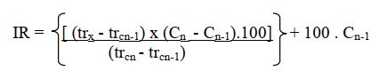

# CalculoIndicedeRetencaoCGEM

Script para cálculo dos índice de retenção de compostos encontrados em Cromatografia Gasosa acoplada ao Espectrômetro de Massas (CG-EM), de acordo com:

trx: tempo de retenção do analito;
trcn: tempo de retenção do n-alcano posterior ao analito;
trcn-1: tempo de retenção do n-alcano anterior ao analito;
Cn: número de carbono do n- alcano posterior;
Cn-1: número de carbono do n- alcano anterior.

O script foi feito para usar com resultados exportados do programa GCMS Postrun Analysis, porém roda com tabelas em outros formatos também.
É necessário duas tabelas:

1. uma tabla com os índices de retenção da série homólogas de hidrocarbonetos
2. uma tabela com os índices de retenção dos compostos de interesse (i.e. para os quais se deseja calcular o índice de retenção)

No repositório existe uma tabela de exemplo para ambas (AlcanosIR.xlsx e OleosIR.xlsx; tabela de hidrocarbonetos e de compostos para cálculo, respectivamente).

O script gera uma tabela mantendo as colunas que estavam na tabela de com os compostos de interesse, mais: 

Retenção do composto de interesse (coluna "analito"),
Retenção do alcano anterior (coluna "ret_n_anterior"), 
Retenção do alcano posterior (coluna "ret_n_posterior"),
Número de carbonos do alcano anterior (coluna "n_carb_anterior"), 
Número de carbonos do alcano posterior (coluna "n_carb_posterior) e 
Índice de Retenção do composto (coluna "indice_ret")

A tabela será salva em .txt, no local e com o nome indicado no começo do script.
